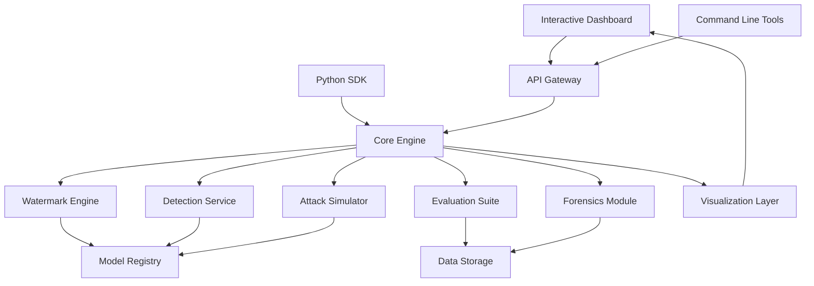
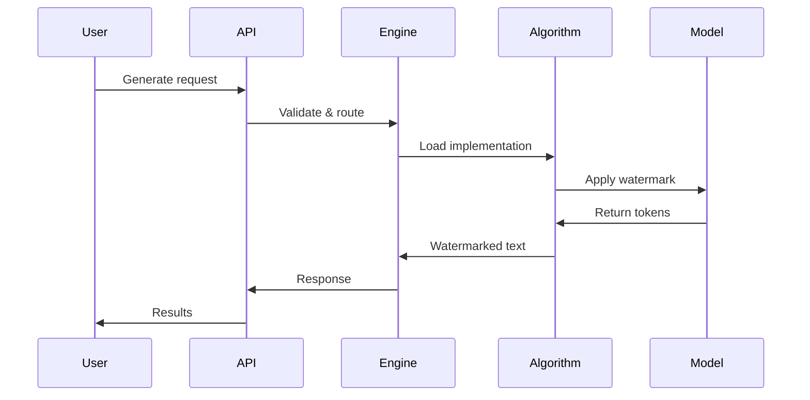
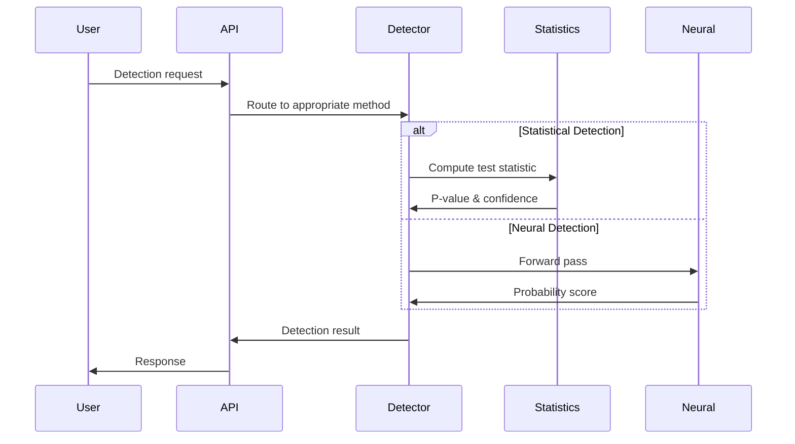

# LM Watermark Lab - System Architecture

## 1. System Overview

LM Watermark Lab is a modular research framework designed for watermarking, detecting, and analyzing LLM-generated text. The architecture follows a microservices pattern with clear separation of concerns and standardized interfaces.



## 2. Core Components

### 2.1 Watermark Engine
**Purpose**: Generate watermarked text using various algorithms
**Location**: `src/watermark_lab/watermarking/`

```python
class WatermarkEngine:
    """Central orchestrator for watermarking operations."""
    
    def __init__(self):
        self.algorithms = AlgorithmRegistry()
        self.model_manager = ModelManager()
    
    def create_watermarker(self, method: str, **config) -> BaseWatermark
    def generate_batch(self, prompts: List[str], **params) -> List[str]
    def export_config(self, watermarker: BaseWatermark) -> Dict
```

**Sub-components**:
- `AlgorithmRegistry`: Factory for watermarking implementations
- `ModelManager`: Handles model loading and caching
- `ConfigValidator`: Ensures parameter validity
- `BatchProcessor`: Optimizes multi-sample processing

### 2.2 Detection Service
**Purpose**: Identify watermarked text with confidence scores
**Location**: `src/watermark_lab/detection/`

```python
class DetectionService:
    """Multi-algorithm watermark detection."""
    
    def detect(self, text: str, config: WatermarkConfig) -> DetectionResult
    def detect_batch(self, texts: List[str]) -> List[DetectionResult]
    def train_neural_detector(self, training_data: Dataset) -> NeuralDetector
```

**Sub-components**:
- `StatisticalDetector`: Hypothesis testing approaches
- `NeuralDetector`: Deep learning-based detection
- `MultiWatermarkDetector`: Identifies watermark type
- `ConfidenceCalibrator`: Calibrates detection scores

### 2.3 Attack Simulator
**Purpose**: Test watermark robustness against various attacks
**Location**: `src/watermark_lab/attacks/`

```python
class AttackSimulator:
    """Simulate attacks on watermarked text."""
    
    def register_attack(self, name: str, attack: BaseAttack)
    def run_attack(self, text: str, attack_name: str) -> AttackResult
    def evaluate_robustness(self, watermark: str, attacks: List[str]) -> RobustnessReport
```

**Attack Types**:
- `ParaphraseAttack`: T5, Pegasus, ChatGPT-based paraphrasing
- `AdversarialAttack`: Gradient-based token substitution
- `TruncationAttack`: Partial text removal
- `TranslationAttack`: Round-trip translation
- `SynonymAttack`: Contextual word replacement

### 2.4 Evaluation Suite
**Purpose**: Assess watermark quality and performance
**Location**: `src/watermark_lab/evaluation/`

```python
class EvaluationSuite:
    """Comprehensive watermark evaluation."""
    
    def evaluate_quality(self, original: str, watermarked: str) -> QualityMetrics
    def evaluate_detectability(self, samples: List[Sample]) -> DetectabilityMetrics
    def compute_tradeoffs(self, method: str, params: Dict) -> TradeoffCurve
```

**Metrics**:
- **Quality**: Perplexity, BLEU, BERTScore, Diversity, Coherence
- **Detectability**: ROC-AUC, Precision, Recall, F1-Score
- **Robustness**: Attack success rates, Signal degradation
- **Performance**: Generation speed, Detection latency

### 2.5 Forensics Module
**Purpose**: Trace watermarks and analyze contamination
**Location**: `src/watermark_lab/forensics/`

```python
class ForensicsModule:
    """Watermark forensics and attribution."""
    
    def trace_watermark(self, original: str, modified: str) -> WatermarkTrace
    def scan_contamination(self, dataset: Dataset) -> ContaminationReport
    def attribute_source(self, text: str) -> AttributionResult
```

## 3. Data Flow Architecture

### 3.1 Generation Pipeline


### 3.2 Detection Pipeline


## 4. Storage Architecture

### 4.1 Data Organization
```
data/
├── models/                 # Cached model weights
│   ├── gpt2-medium/
│   ├── opt-1.3b/
│   └── llama-2-7b/
├── datasets/              # Evaluation datasets
│   ├── c4/
│   ├── openwebtext/
│   └── wikipedia/
├── experiments/           # Experimental results
│   ├── 2024-01-15_benchmark/
│   └── 2024-01-20_robustness/
├── configs/              # Watermark configurations
│   ├── kirchenbauer.yaml
│   ├── markllm.yaml
│   └── custom.yaml
└── cache/                # Temporary processing cache
    ├── embeddings/
    └── detections/
```

### 4.2 Configuration Management
```yaml
# Example: configs/kirchenbauer.yaml
watermark:
  type: "kirchenbauer"
  model: "facebook/opt-1.3b"
  parameters:
    gamma: 0.25
    delta: 2.0
    seed: 42
    vocab_size: 50264
  
detection:
  test_type: "multinomial"
  alpha: 0.05
  min_tokens: 50

quality:
  reference_model: "gpt2-medium"
  metrics: ["perplexity", "bleu", "bertscore"]
```

## 5. API Design

### 5.1 RESTful Endpoints
```python
# Generation API
POST /api/v1/generate
{
    "method": "kirchenbauer",
    "prompts": ["The future of AI is"],
    "config": {...},
    "options": {"max_length": 200}
}

# Detection API
POST /api/v1/detect
{
    "texts": ["Watermarked text sample"],
    "watermark_config": {...},
    "return_details": true
}

# Evaluation API
POST /api/v1/evaluate
{
    "original_texts": [...],
    "watermarked_texts": [...],
    "metrics": ["perplexity", "bleu"]
}
```

### 5.2 WebSocket Streaming
```javascript
// Real-time generation
const ws = new WebSocket('ws://localhost:8080/api/v1/stream/generate');
ws.send(JSON.stringify({
    method: "kirchenbauer",
    prompt: "Tell me about",
    stream: true
}));
```

## 6. Security Architecture

### 6.1 Authentication & Authorization
```python
class SecurityManager:
    """Handle API security and access control."""
    
    def authenticate_request(self, token: str) -> User
    def authorize_operation(self, user: User, operation: str) -> bool
    def audit_log(self, user: User, action: str, details: Dict)
```

### 6.2 Input Validation
```python
class InputValidator:
    """Validate and sanitize user inputs."""
    
    def validate_text(self, text: str) -> bool
    def sanitize_config(self, config: Dict) -> Dict
    def check_rate_limits(self, user: User) -> bool
```

## 7. Deployment Architecture

### 7.1 Container Strategy
```dockerfile
# Multi-stage build for optimization
FROM python:3.9-slim as base
FROM base as dependencies
FROM dependencies as application
FROM application as production
```

### 7.2 Service Orchestration
```yaml
# docker-compose.yml
version: '3.8'
services:
  api:
    build: .
    ports: ["8080:8080"]
    environment:
      - MODEL_CACHE_PATH=/data/models
    volumes:
      - ./data:/data
  
  worker:
    build: .
    command: celery worker
    environment:
      - REDIS_URL=redis://redis:6379
    
  redis:
    image: redis:alpine
    
  monitoring:
    image: prometheus:latest
    ports: ["9090:9090"]
```

## 8. Scalability Patterns

### 8.1 Horizontal Scaling
- **Load Balancing**: Distribute API requests across multiple instances
- **Worker Pools**: Scale processing with Celery workers
- **Model Sharding**: Distribute large models across GPUs
- **Caching**: Redis for frequently accessed data

### 8.2 Performance Optimization
- **Batch Processing**: Group requests for efficient GPU utilization
- **Model Quantization**: Reduce memory footprint
- **Async Operations**: Non-blocking I/O for API endpoints
- **Connection Pooling**: Reuse database connections

## 9. Monitoring and Observability

### 9.1 Metrics Collection
```python
# Prometheus metrics
generation_time = Histogram('watermark_generation_seconds')
detection_accuracy = Gauge('watermark_detection_accuracy')
api_requests = Counter('api_requests_total', ['method', 'endpoint'])
```

### 9.2 Distributed Tracing
```python
# OpenTelemetry integration
@tracer.start_as_current_span("watermark_generation")
def generate_watermarked_text(prompt: str) -> str:
    with tracer.start_as_current_span("model_inference"):
        return model.generate(prompt)
```

## 10. Extension Points

### 10.1 Plugin Architecture
```python
class PluginManager:
    """Manage algorithm plugins."""
    
    def register_watermark_algorithm(self, name: str, cls: Type[BaseWatermark])
    def register_attack_method(self, name: str, cls: Type[BaseAttack])
    def register_metric(self, name: str, func: Callable)
```

### 10.2 Custom Algorithms
```python
class CustomWatermark(BaseWatermark):
    """Template for custom watermarking algorithms."""
    
    def __init__(self, model: str, **kwargs):
        super().__init__(model)
        self.configure(**kwargs)
    
    def generate(self, prompt: str, **kwargs) -> str:
        # Custom implementation
        pass
    
    def get_config(self) -> WatermarkConfig:
        # Return configuration
        pass
```

This architecture ensures modularity, scalability, and maintainability while providing clear interfaces for research and development in LLM watermarking.