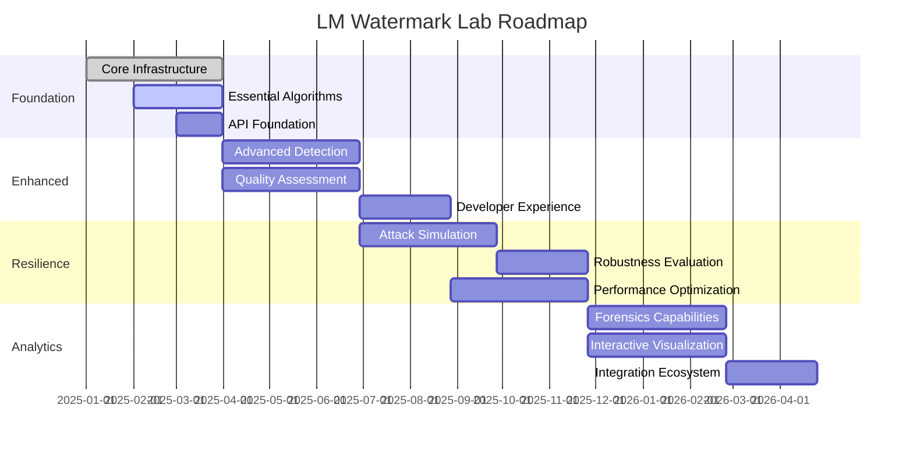

# LM Watermark Lab - Product Roadmap

## Version 1.0 - Foundation (Q1 2025)

### Core Infrastructure
- ✅ Project architecture and design patterns
- 🔄 Base classes and plugin system
- 🔄 Configuration management framework
- 🔄 Testing infrastructure and CI/CD
- 🔄 Documentation system

### Essential Algorithms
- 🔄 Kirchenbauer et al. watermarking
- 🔄 Aaronson cryptographic approach
- 🔄 Statistical detection methods
- 🔄 Basic quality metrics (perplexity, BLEU)

### API Foundation
- 🔄 RESTful API with FastAPI
- 🔄 Basic authentication system
- 🔄 OpenAPI documentation
- 🔄 Docker containerization

**Success Metrics**: 3 working algorithms, <2s generation time, 95% test coverage

---

## Version 1.1 - Enhanced Detection (Q2 2025)

### Advanced Detection
- ⏳ Neural detection models
- ⏳ Multi-watermark identification
- ⏳ Confidence calibration
- ⏳ Batch processing optimization

### Quality Assessment
- ⏳ BERTScore and semantic metrics
- ⏳ Human evaluation proxies
- ⏳ Diversity and coherence measures
- ⏳ Trade-off analysis tools

### Developer Experience
- ⏳ Python SDK with examples
- ⏳ Jupyter notebook tutorials
- ⏳ Command-line interface
- ⏳ Plugin development guide

**Success Metrics**: 5 algorithms, <100ms detection, neural detector >90% accuracy

---

## Version 1.2 - Attack Resilience (Q3 2025)

### Attack Simulation
- ⏳ Paraphrasing attacks (T5, Pegasus)
- ⏳ Adversarial token substitution
- ⏳ Translation and back-translation
- ⏳ Truncation and modification attacks

### Robustness Evaluation
- ⏳ Comprehensive attack benchmarks
- ⏳ Robustness metrics and scoring
- ⏳ Attack success rate analysis
- ⏳ Defense mechanism evaluation

### Performance Optimization
- ⏳ GPU acceleration for detection
- ⏳ Model quantization and optimization
- ⏳ Caching and memoization
- ⏳ Async processing pipelines

**Success Metrics**: 8 attack types, robustness benchmarks, 5x faster processing

---

## Version 2.0 - Advanced Analytics (Q4 2025)

### Forensics Capabilities
- ⏳ Watermark tracing through transformations
- ⏳ Contamination detection in datasets
- ⏳ Attribution to specific sources
- ⏳ Signal degradation analysis

### Interactive Visualization
- ⏳ Web-based dashboard
- ⏳ Real-time generation and detection
- ⏳ Interactive parameter tuning
- ⏳ Comparative analysis tools

### Integration Ecosystem
- ⏳ MarkLLM integration
- ⏳ Weights & Biases logging
- ⏳ MLflow experiment tracking
- ⏳ Cloud deployment templates

**Success Metrics**: Forensics accuracy >85%, interactive dashboard, cloud deployment

---

## Version 2.1 - Research Platform (Q1 2026)

### Advanced Algorithms
- ⏳ SWEET (Microsoft) implementation
- ⏳ Zhao et al. robust watermarking
- ⏳ Custom algorithm framework
- ⏳ Ensemble watermarking methods

### Large-Scale Evaluation
- ⏳ Distributed benchmarking
- ⏳ Multi-dataset evaluation
- ⏳ Automated leaderboards
- ⏳ Reproducibility framework

### Research Tools
- ⏳ Experiment management system
- ⏳ Statistical analysis suite
- ⏳ Publication-ready visualizations
- ⏳ Collaboration features

**Success Metrics**: 10+ algorithms, distributed evaluation, research adoption

---

## Version 2.2 - Production Ready (Q2 2026)

### Enterprise Features
- ⏳ Multi-tenant architecture
- ⏳ Role-based access control
- ⏳ Audit logging and compliance
- ⏳ SLA monitoring and alerting

### Scalability & Performance
- ⏳ Kubernetes deployment
- ⏳ Auto-scaling capabilities
- ⏳ Load balancing and failover
- ⏳ Performance monitoring

### Security Hardening
- ⏳ End-to-end encryption
- ⏳ Secure key management
- ⏳ Vulnerability scanning
- ⏳ Penetration testing

**Success Metrics**: 99.9% uptime, enterprise deployment, security certification

---

## Version 3.0 - AI-Native Platform (Q3 2026)

### Intelligent Features
- ⏳ Automated parameter optimization
- ⏳ AI-powered attack generation
- ⏳ Predictive quality assessment
- ⏳ Smart watermark selection

### Multi-Modal Support
- ⏳ Image watermarking integration
- ⏳ Audio watermarking support
- ⏳ Cross-modal detection
- ⏳ Unified forensics platform

### Advanced Analytics
- ⏳ ML-powered insights
- ⏳ Trend analysis and prediction
- ⏳ Anomaly detection
- ⏳ Automated reporting

**Success Metrics**: AI optimization, multi-modal support, predictive analytics

---

## Long-Term Vision (2027+)

### Research Leadership
- 🔮 Novel algorithm discovery platform
- 🔮 Automated research assistant
- 🔮 Academic collaboration network
- 🔮 Standards development influence

### Industry Adoption
- 🔮 Enterprise SaaS platform
- 🔮 Integration with major AI providers
- 🔮 Regulatory compliance tools
- 🔮 Industry certification program

### Global Impact
- 🔮 Open research consortium
- 🔮 Educational curriculum integration
- 🔮 Policy recommendation system
- 🔮 Ethical AI advocacy

---

## Milestone Dependencies

## Success Metrics by Version

| Version | Algorithms | Performance | Accuracy | Features |
|---------|------------|-------------|----------|----------|
| 1.0 | 3 | <2s gen | 95% detect | Basic API |
| 1.1 | 5 | <100ms detect | 90% neural | SDK + CLI |
| 1.2 | 5 | 5x faster | 85% robust | 8 attacks |
| 2.0 | 7 | Real-time | 85% forensics | Dashboard |
| 2.1 | 10+ | Distributed | Research-grade | Experiments |
| 2.2 | 10+ | 99.9% uptime | Enterprise | Production |
| 3.0 | Auto-gen | AI-optimized | Multi-modal | Intelligent |

## Risk Mitigation

### Technical Risks
- **Algorithm Compatibility**: Maintain adapter patterns and version compatibility
- **Performance Bottlenecks**: Continuous profiling and optimization
- **Model Drift**: Automated testing against model updates
- **Scalability Limits**: Early load testing and architecture reviews

### Market Risks
- **Research Competition**: Focus on unique value propositions
- **Technology Shifts**: Flexible architecture for new paradigms
- **Funding Constraints**: Incremental delivery and value demonstration
- **Adoption Barriers**: Strong documentation and community support

### Operational Risks
- **Team Scalability**: Knowledge documentation and mentoring
- **Quality Assurance**: Automated testing and code review
- **Security Vulnerabilities**: Regular audits and updates
- **Compliance Changes**: Monitoring regulatory developments

## Community Engagement

### Developer Community
- Open-source contributions and collaboration
- Regular hackathons and challenges
- Academic research partnerships
- Industry advisory board

### User Community
- User feedback and feature requests
- Beta testing programs
- Documentation and tutorials
- Community forum and support

### Research Community
- Conference presentations and papers
- Reproducibility initiatives
- Benchmark standardization
- Ethical guidelines development

This roadmap provides a clear path toward building the most comprehensive LLM watermarking platform while maintaining flexibility to adapt to emerging research and industry needs.