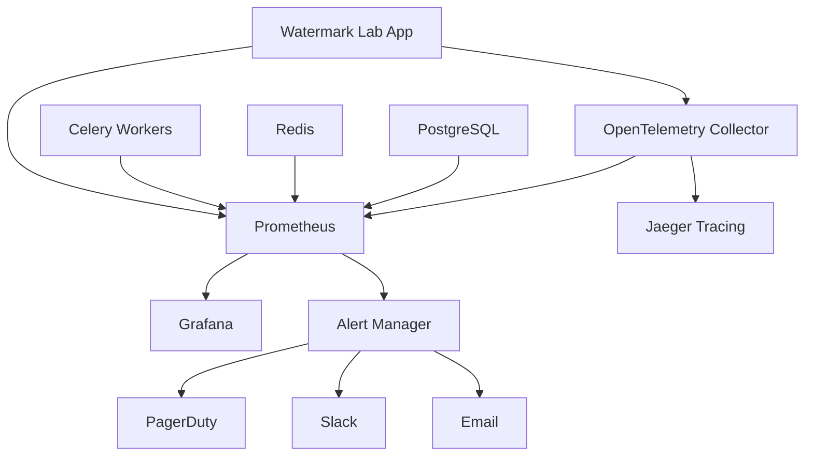

# LM Watermark Lab - Monitoring Runbook

## Overview

This runbook provides operational procedures for monitoring and maintaining the LM Watermark Lab system.

## Architecture



## Key Metrics

### Application Metrics

| Metric | Description | Alert Threshold |
|--------|-------------|-----------------|
| `http_requests_total` | Total HTTP requests | - |
| `http_request_duration_seconds` | Request latency | P95 > 2s |
| `watermark_generations_total` | Watermark generation count | - |
| `watermark_detections_total` | Detection count | - |
| `model_loads_total` | Model loading events | - |
| `cache_hit_rate` | Cache efficiency | < 70% |
| `active_connections` | Current connections | > 1000 |

### System Metrics

| Metric | Description | Alert Threshold |
|--------|-------------|-----------------|
| `cpu_usage_percent` | CPU utilization | > 80% |
| `memory_usage_percent` | Memory utilization | > 80% |
| `disk_usage_percent` | Disk utilization | > 90% |
| `network_io_bytes` | Network I/O | - |
| `container_restarts` | Container restart count | > 5/hour |

## Alert Levels

### Critical (P1)
- Service completely down
- Database unavailable
- High error rate (>10%)
- Memory/disk exhaustion

### Warning (P2)
- High latency (>2s P95)
- High resource usage (>80%)
- Low cache hit rate (<70%)
- Service degradation

### Info (P3)
- Deployment events
- Configuration changes
- Maintenance activities

## Standard Operating Procedures

### 1. Service Health Check

```bash
# Check all services
docker-compose ps

# Check application health
curl -f http://localhost:8080/health

# Check metrics endpoint
curl http://localhost:8080/metrics

# Check logs
docker-compose logs -f app
```

### 2. Performance Investigation

```bash
# Check resource usage
docker stats

# Monitor in real-time
htop
iotop
netstat -tuln

# Application-specific metrics
# Access Grafana dashboard: http://localhost:3000
# Default credentials: admin/admin
```

### 3. Alert Response

#### High Error Rate Alert

1. **Immediate Actions**
   ```bash
   # Check application logs
   docker-compose logs --tail=100 app
   
   # Check error patterns
   grep -i error /app/logs/watermark_lab.log | tail -20
   
   # Verify external dependencies
   curl -f http://redis:6379
   pg_isready -h postgres -p 5432
   ```

2. **Investigation**
   - Review recent deployments
   - Check resource constraints
   - Analyze error patterns
   - Verify configuration changes

3. **Resolution**
   - Rollback if deployment-related
   - Scale resources if capacity issue
   - Fix configuration if config-related
   - Apply hotfix if code bug

#### High Latency Alert

1. **Immediate Actions**
   ```bash
   # Check active requests
   curl http://localhost:8080/metrics | grep http_requests
   
   # Monitor database performance
   docker-compose exec postgres psql -c "SELECT * FROM pg_stat_activity;"
   
   # Check cache performance
   docker-compose exec redis redis-cli info stats
   ```

2. **Investigation**
   - Analyze slow queries
   - Check model loading times
   - Review cache hit rates
   - Monitor resource utilization

#### Service Down Alert

1. **Immediate Actions**
   ```bash
   # Check container status
   docker-compose ps
   
   # Restart if needed
   docker-compose restart app
   
   # Check startup logs
   docker-compose logs app | tail -50
   ```

2. **Root Cause Analysis**
   - Review application logs
   - Check system resources
   - Verify dependencies
   - Analyze recent changes

### 4. Maintenance Procedures

#### Log Rotation

```bash
# Manual log rotation
docker-compose exec app logrotate /etc/logrotate.conf

# Clear old logs
find /app/logs -name "*.log.*" -mtime +7 -delete
```

#### Database Maintenance

```bash
# Vacuum database
docker-compose exec postgres psql -c "VACUUM ANALYZE;"

# Check database size
docker-compose exec postgres psql -c "SELECT pg_size_pretty(pg_database_size('watermark_lab'));"
```

#### Cache Maintenance

```bash
# Check Redis memory usage
docker-compose exec redis redis-cli info memory

# Clear cache if needed
docker-compose exec redis redis-cli FLUSHDB
```

## Monitoring Dashboard URLs

- **Grafana**: http://localhost:3000
- **Prometheus**: http://localhost:9090
- **AlertManager**: http://localhost:9093
- **Jaeger**: http://localhost:16686

## Key Performance Indicators (KPIs)

### Service Level Objectives (SLOs)

| Metric | Target | Measurement Period |
|--------|--------|--------------------|
| Availability | 99.9% | 30 days |
| P95 Latency | < 2s | 24 hours |
| Error Rate | < 1% | 24 hours |
| Throughput | > 100 req/s | Peak hours |

### Business Metrics

| Metric | Description | Target |
|--------|-------------|--------|
| Generation Success Rate | % of successful watermark generations | > 99% |
| Detection Accuracy | % of correct watermark detections | > 95% |
| Model Load Time | Average time to load models | < 30s |
| Cache Hit Rate | % of requests served from cache | > 80% |

## Troubleshooting Guide

### Common Issues

#### 1. Out of Memory (OOM)

**Symptoms:**
- Container restarts frequently
- High memory alerts
- Slow response times

**Diagnosis:**
```bash
# Check memory usage
docker stats --no-stream

# Check memory limits
docker inspect watermark-lab-app | grep -i memory

# Review memory-intensive operations
grep -i "memory\|oom" /app/logs/watermark_lab.log
```

**Resolution:**
- Increase container memory limits
- Optimize model loading strategy
- Implement model quantization
- Add memory-efficient caching

#### 2. Database Connection Issues

**Symptoms:**
- Database connection errors
- Slow query performance
- Connection pool exhaustion

**Diagnosis:**
```bash
# Check database connectivity
pg_isready -h postgres -p 5432

# Monitor active connections
docker-compose exec postgres psql -c "SELECT count(*) FROM pg_stat_activity;"

# Check connection pool status
grep -i "connection\|pool" /app/logs/watermark_lab.log
```

**Resolution:**
- Restart database service
- Tune connection pool settings
- Optimize slow queries
- Scale database resources

#### 3. Cache Performance Issues

**Symptoms:**
- Low cache hit rates
- High Redis memory usage
- Slow response times

**Diagnosis:**
```bash
# Check cache statistics
docker-compose exec redis redis-cli info stats

# Monitor cache hit ratio
docker-compose exec redis redis-cli info stats | grep hits

# Check memory usage
docker-compose exec redis redis-cli info memory
```

**Resolution:**
- Tune cache expiration policies
- Optimize cache key strategies
- Increase Redis memory limit
- Implement cache warming

## Emergency Procedures

### Complete Service Outage

1. **Immediate Response**
   ```bash
   # Check all services
   docker-compose ps
   
   # Restart all services
   docker-compose restart
   
   # Monitor startup
   docker-compose logs -f
   ```

2. **Communication**
   - Update status page
   - Notify stakeholders
   - Provide regular updates

3. **Recovery**
   - Implement emergency fixes
   - Monitor service recovery
   - Conduct post-incident review

### Data Loss/Corruption

1. **Immediate Response**
   - Stop affected services
   - Assess data integrity
   - Activate backup procedures

2. **Recovery**
   ```bash
   # Restore from backup
   docker-compose exec postgres pg_restore -d watermark_lab /backups/latest.sql
   
   # Verify data integrity
   docker-compose exec postgres psql -c "SELECT count(*) FROM experiments;"
   ```

## Contact Information

### On-Call Rotation
- **Primary**: DevOps Team
- **Secondary**: Backend Team
- **Escalation**: Engineering Manager

### External Services
- **Cloud Provider**: [Provider Support]
- **Monitoring**: [Monitoring Service Support]
- **Database**: [Database Support]

## References

- [Prometheus Documentation](https://prometheus.io/docs/)
- [Grafana Documentation](https://grafana.com/docs/)
- [OpenTelemetry Documentation](https://opentelemetry.io/docs/)
- [Application Architecture](../ARCHITECTURE.md)
- [Deployment Guide](../DEPLOYMENT.md)